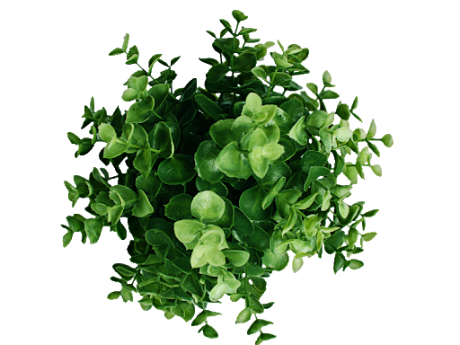
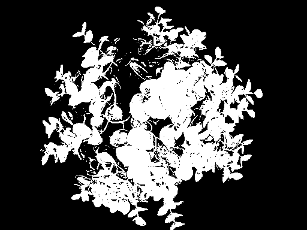

# Image_Analysis
Computer Vision Image Analysis

### A made up story

One of my friend asked me to help him in his research related to treatment of plants. As he is from non-technical field, he do not know about any machine learning techniques. so he wanted to estimate by image analysis the area proportion of leaf vs non-leaf in the images.

### Approach
We all know how computer vision is becoming ubiquitous in machine learning methods. This task is simple in computer vision as compared to complex methods such as deep learning. The approach is to extract only plant color pixels that is green colour pixel as most to the plant are green in images. Now we have the green pixel what we do is to calculate the percent of green pixels and other pixels (black pixels) as my friend want is a number, like a percentage leaf cover, for each images that he shared with me. 

### Example

Leaf pixels: 54889 |                                                                                                                  Image pixels: 196608 |                                                                                                                Area: 27.917989095052082

### Requirements
- Opencv
- Python 3.6 or above
- Numpy
- Pillow
- Os
